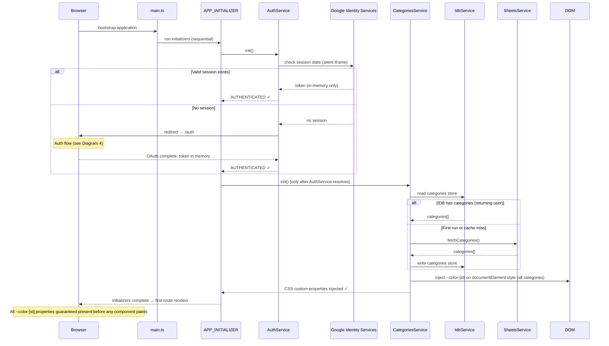
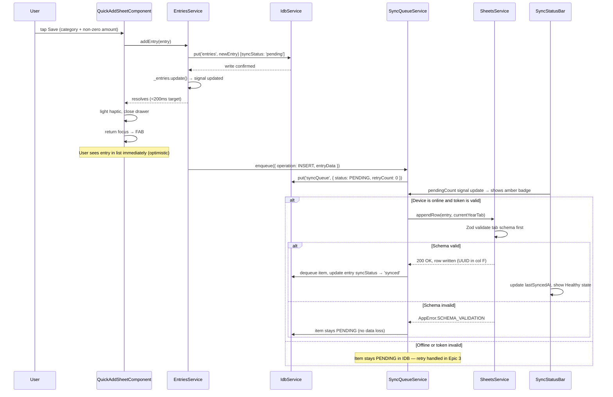
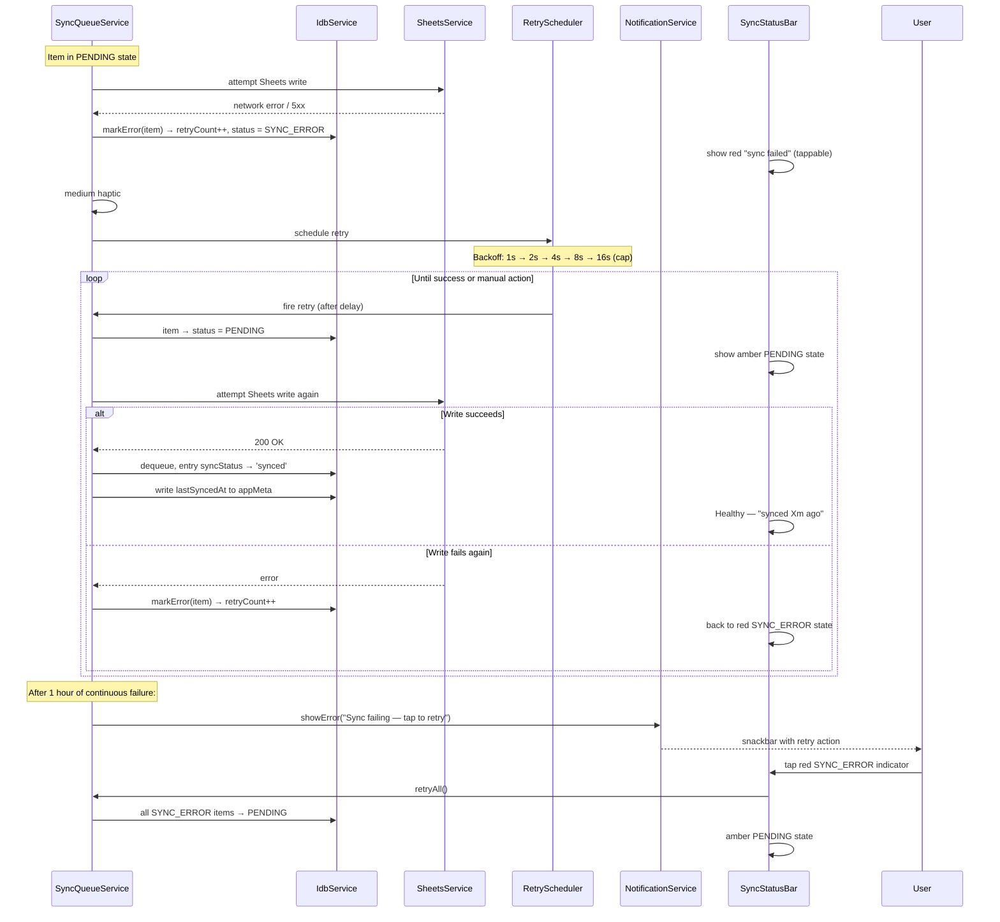
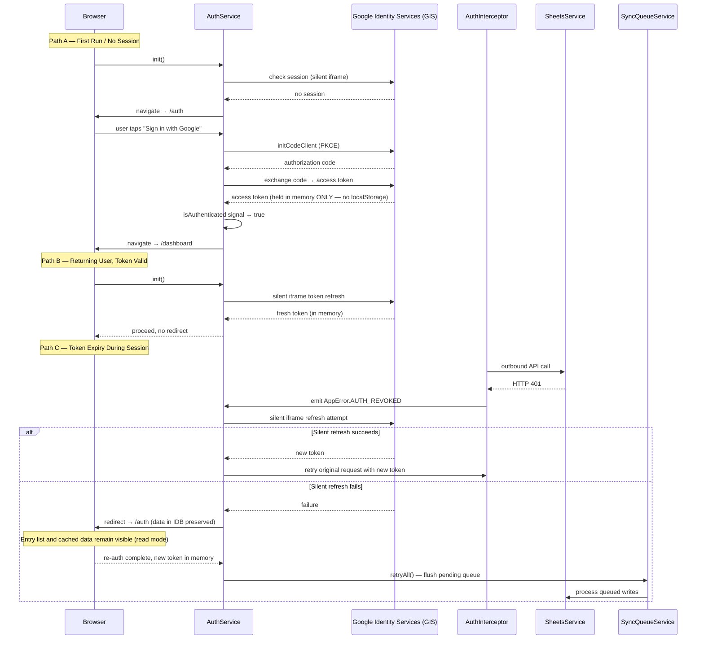
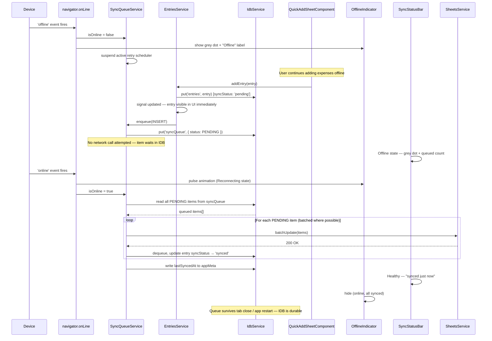

# Sequence Diagrams — expense-dashboard

Generated: 2026-05-08
Source: architecture.md + epics.md

---

## Diagram 1 — App Boot & APP_INITIALIZER Chain (Stories 1.2, 1.5, 1.6)

The boot sequence is the highest-risk ordering problem in the project. `AuthService.init()` must fully complete before `CategoriesService.init()` begins, and all CSS custom properties must be injected before any component renders.

---

## Diagram 2 — Add Expense: Optimistic Write + Sync Queue Enqueue (Story 2.2, 2.5)

The core write path. The UI must update in <200ms via IDB — the Sheets write is fully background. Developers must never await the Sheets call before updating the signal.

---

## Diagram 3 — Sync Queue State Machine: Retry & Exponential Backoff (Stories 3.1, 3.2, 3.3)

The full state machine for queue items. This is Epic 3's core complexity. The PENDING → SYNC_ERROR transition and exponential backoff schedule must be clear before implementation begins.

---

## Diagram 4 — OAuth PKCE + Token Refresh + Re-auth Resilience (Stories 1.2, 1.3)

Token lifecycle is a hidden complexity axis. Silent refresh is the happy path; the fallback to redirect must preserve all queued data. This diagram covers all three auth transitions developers will need to handle.

---

## Diagram 5 — Offline Detection, Queue Survival & Reconnect Flush (Story 3.4)

Offline resilience is a first-class requirement (NFR-R1: zero entries lost). This diagram shows the full offline → reconnect cycle and how the queue auto-flushes on reconnect.

