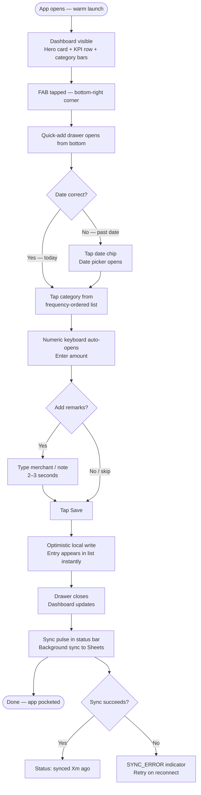
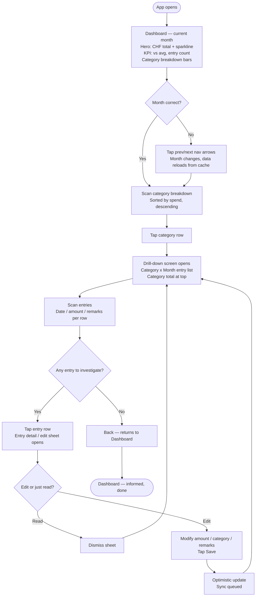
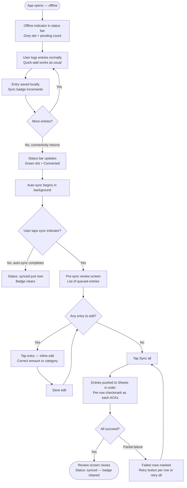
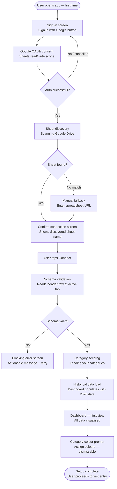

# UX Design Specification — expense-dashboard

**Author:** Nick
**Date:** 2026-05-08

---

<!-- UX design content will be appended sequentially through collaborative workflow steps -->

## Executive Summary

### Project Vision

expense-dashboard is the front-end Nick's Google Sheet never had — a single-user,
self-hosted, CHF-denominated personal expense tracker that treats Google Sheets as
a persistence and sync layer, not a UX dependency. The mission is twofold: make
"how am I doing this month?" answerable in under 10 seconds, and make expense
logging so frictionless that it becomes a reflex rather than a decision.

The app has no subscription cost, no vendor lock-in, and no imposed schema.
The Sheet is the config; the app is the experience. Architecturally, this design
commits to **local-first**: all data lives in local storage first, with Sheets as
the async durable backup. This single commitment resolves the sync latency problem,
the cold-launch performance problem, and the offline story simultaneously.

### Target Users

**Primary user: Nick (single-user personal tool)**

- Technically literate; comfortable with OAuth flows, PWA installation, and self-hosting
- iPhone as primary device; desktop Chrome as secondary
- Has an existing multi-year expense Sheet with ~20 established categories
  (Groceries, Eat out, Rent, Transportation, etc.)
- Currently navigates raw spreadsheet rows to understand monthly spending —
  a manual, friction-heavy process the app directly replaces
- Values data ownership: no third-party data storage, no subscription, full control
- Two distinct usage modes with opposite UX needs:
  - **Quick-add** — standing at a checkout, phone in one hand, 15 seconds, zero
    decision fatigue. The app must be a reflex, not a decision.
  - **Monthly review** — seated, exploratory, unhurried. Sunday morning with coffee.

### Key Design Challenges

1. **The kill condition is cognitive load, not tap count** — The ≤3-tap threshold
   is a proxy for "is this app a reflex or a decision?" The real threat is anything
   that causes Nick to scan or decide before his first tap. The quick-add trigger
   must be immediately obvious and unreachable by accident. All other features —
   sync indicators, batch mode, category management — are fine to exist as long as
   they cannot compete for visual weight with the primary action.

2. **Two entry points, not two modes on one screen** — Quick-add and monthly review
   have opposite UX postures and should not be balanced on a single surface. The
   design challenge is building a clear, intentional door between them — ideally
   one where completing a quick-add naturally invites exploration ("you're at 68%
   of last month's spending"), making review mode feel like a reward rather than
   a separate destination.

3. **Sync state: design the healthy baseline first** — The anxiety lives in error
   states, but trust is built during routine, uneventful syncs. A quiet "synced
   2 min ago" present on every session does more for long-term trust than any
   error-state design. The healthy state must be calm, present, and credible before
   the error states are designed at all.

### Design Opportunities

1. **Smart category ordering** — ~20 categories exist but a handful dominate daily
   use. Recency/frequency-ordered category picker — requiring no configuration,
   learned purely through observation — reduces cognitive load on every single entry.
   This is a small interaction with outsized daily impact.

2. **Dashboard as the act-on-it surface** — The dashboard's primary job is to
   let Nick *act*: spot an overage, understand where it came from, decide whether
   to care. The sparkline and category breakdown serve this job. Design the dashboard
   around one clear answer to "what do I do with this information?" — not around
   making Nick feel informed.

3. **Offline as control, not limitation** — The pre-sync review screen is an
   opportunity to frame sync as deliberate and trustworthy ("here's what's
   queued — your call") rather than an error-recovery flow. This reframe turns a
   technical constraint into a relationship: the app works *for* Nick, not the
   other way around. This posture should extend to the whole product — categories
   ordered by his behavior, spending context surfaced from his history, nothing
   requiring explicit configuration.

## Core User Experience

### Defining Experience

The defining experience is the quick-add: Nick opens the app, the add trigger is
immediately visible and unambiguous, date is pre-filled to today, category list
is ordered by his personal usage frequency, he taps a category and types an amount,
hits Save — done. The entry is instantly in the local list. Sync happens silently.
He never waits.

This is not a 3-tap interaction because of good tap choreography. It is a reflex
because every default is already right and no decision is required before the first
action. The app earns its place the first time Nick closes it before he's even
finished his receipt.

### Platform Strategy

- **Primary platform:** Mobile PWA on iOS Safari (iPhone). One-handed, touch-first,
  installable to home screen, full-screen with no browser chrome once installed.
- **Secondary platform:** Desktop Chrome. Wider layout, same data model, no
  dedicated design effort beyond responsive comfort.
- **Offline:** Mandatory, not optional. The app must be fully functional with no
  network — entry, viewing, and browsing all work from local state. Sync is a
  background feature, not a foreground requirement.
- **Local-first architecture:** All data persists locally (IndexedDB) first.
  Google Sheets is the async durable backup. No interaction ever waits on a
  network call. This is an architectural commitment, not a design preference — it
  is the prerequisite for both the ≤3-tap guarantee and the offline story.

### Effortless Interactions

- **App open → add form:** The add trigger (FAB, fixed position) is visible
  immediately without scrolling or navigating. No decision required before
  the first tap.
- **Date default:** Today. Always. The user overrides only when logging past
  entries — the common case requires no input.
- **Category selection:** Ordered by personal recency/frequency, learned
  automatically. The most-used category is always near the top.
- **Entry save:** Optimistic local write — the entry appears in the list
  instantly. Sheets sync is background and silent on success.
- **Dashboard on open:** Current month total and breakdown are visible on
  first navigation to the dashboard without further interaction.

### Critical Success Moments

1. **First entry saved** — Nick logs an expense faster than he would have by
   opening Google Sheets. This is the app earning its existence. If this moment
   fails, nothing else matters.
2. **First dashboard glance** — He sees his current month total and category
   breakdown and immediately knows whether he's on track. No formula, no
   scrolling, no pivot table.
3. **First drill-down** — He taps a category and sees every entry for that
   category this month. This is the hero feature making its case.
4. **First offline recovery** — He syncs a queue of entries after being offline
   and every row lands exactly right, in order, with no duplicates. This is the
   trust-cementing moment that makes the app feel reliable long-term.

### Experience Principles

1. **Reflex, not decision** — Every core interaction must be completable without
   conscious thought. If Nick has to scan, read, or decide before acting, the
   design has failed. Defaults handle the common case; overrides are available
   but never required.

2. **Local-first, always** — The app is always fully usable. Sheets is a sync
   target, not a dependency. No screen, interaction, or data view ever waits
   on a network call.

3. **Observation over configuration** — The app learns Nick's habits through use
   and surfaces them automatically: category ordering by frequency, spending
   context from history, sync state communicated calmly. He should never have
   to configure what the app can simply observe.

4. **Act on it, don't just show it** — Every dashboard element exists to help
   Nick decide or act, not to inform him abstractly. Before placing any element,
   the design asks: "What does Nick do next with this information?"

## Desired Emotional Response

### Primary Emotional Goals

The primary emotional goal is **in control, not chasing**. Nick's current
relationship with his finances is reactive — he opens Sheets when something feels
off, scrolls manually, closes it without a clear answer. This app should flip
that dynamic: he should feel *ahead* of his spending, not catching up with it.
The app should feel like it already knows what he's about to ask.

### Emotional Journey Mapping

| Moment | Target feeling |
|---|---|
| App opens, add button is immediately visible | *Settled* — "this is where I go" |
| Entry saved in under 10 seconds | *Done* — "that's handled, moving on" |
| Dashboard loads, month total visible | *Clear* — "I know where I stand" |
| Drill-down shows category entries | *Satisfied* — "this is exactly what I needed" |
| Offline entries queue and stay safe | *Trusted* — "the app is looking after this for me" |
| Sync review screen shows queued entries | *In control* — "I decide what gets pushed" |
| Error state / sync failure | *Informed, not alarmed* — "something needs attention, here's what" |

### Micro-Emotions

- **Confidence** (data is right, sync happened, nothing lost) over **skepticism**
  (did that actually save?)
- **Calm efficiency** (in and out fast) over **friction** (what do I tap next?)
- **Clarity** (I know my number) over **vagueness** (am I over? under? I'm not sure)

**Emotions to actively avoid:**
- **Anxiety** about sync state — addressed by designing the healthy baseline first,
  before error states
- **Confusion** about where to tap — addressed by unambiguous visual hierarchy with
  no competing primary actions
- **Guilt** about not logging — the app is a tool, not a tracker that judges; the
  tone should always be neutral and instrumental, never admonishing

### Design Implications

- **"Done" feeling** → Optimistic local write with instant list update; no loading
  spinner between tap and confirmation; the entry appears before the keyboard closes
- **"Trusted" feeling** → Quiet "synced X min ago" on every session; the healthy
  sync state is always visible and calm, not hidden until something breaks
- **"Clear" feeling** → Hero card is the first element seen on the dashboard, month
  total in large type, no navigation or interaction required to reach it
- **"In control" feeling** → Offline queue review is a deliberate, user-initiated
  action ("here's what's queued — your call"), never an error recovery screen

### Emotional Design Principles

1. **Calm by default** — The baseline emotional register of every screen is neutral
   and calm. Alerts and warnings are used only when action is genuinely required,
   never for informational status.

2. **Completion over process** — The emotional reward comes from the task being
   done, not from observing it happen. Hide the plumbing (sync, cache, API calls);
   surface only the result.

3. **The app earns trust quietly** — Trust is built through consistent, uneventful
   behavior across many sessions. Design the routine experience as carefully as the
   error experience — the former happens 99% of the time.

## UX Pattern Analysis & Inspiration

### Inspiring Products Analysis

**Expense IQ (Android)**
The benchmark for what a mobile-native expense tracker feels like done right.
Key UX strengths:
- Category-first entry flow with visual category icons reduces cognitive load
  on the most-repeated interaction
- Monthly bar charts and category breakdowns surface spending patterns without
  requiring the user to construct the question
- Transaction list as the ground truth — always accessible, always scannable
- Designed for the phone, not a shrunken desktop app

**YNAB (You Need A Budget)**
A different product philosophy (zero-based budgeting vs. pure tracking), but
the UX execution is the reference point for making financial data feel actionable.
Key UX strengths:
- Transaction entry is fast and opinionated — it knows what you need to fill in
  and sequences the fields accordingly
- The dashboard answers "what do I do next?" not just "what happened?"
- Visual clarity of consequence: numbers are always in context (vs. a target,
  vs. last month), never raw and meaningless
- Builds genuine user habits through consistent interaction patterns rather
  than reminders or nudges

**The paywall as UX signal**
The reason to stop using an app was hitting a paywall. This is not just a
pricing objection — it's a trust break. When an app gates features, it creates
ambient anxiety about what you're missing, retroactively poisons the experience
of the free tier, and signals that the app's interests and the user's interests
are not aligned. expense-dashboard has no tiers, no gates, no upgrade prompts.
The entire product is always fully available.

### Transferable UX Patterns

**Entry flow patterns:**
- **Category-first selection with visual anchors** (Expense IQ) — color-coded
  label per category reduces read time; visual scanning is faster than text
  scanning at the moment of entry
- **Opinionated field sequencing** (YNAB) — the app decides the order
  (Date → Category → Amount → Remarks), not the user; no blank form to figure out
- **Immediate list confirmation** (both) — the saved entry appears in the list
  instantly; the user sees the result of their action before navigating away

**Dashboard patterns:**
- **Contextual numbers** (YNAB) — amounts shown with a reference point
  (vs. last month via sparkline) rather than as raw values
- **Category breakdown as the primary drill path** (Expense IQ) — tap a category
  to see its entries; this is the primary navigation pattern, not a secondary filter
- **Month as the natural unit** (both) — the calendar month is the default
  time horizon; year and all-time are secondary views

**Trust patterns:**
- **Consistent interaction rhythm** (YNAB) — the same entry flow every time,
  no surprises, builds muscle memory quickly
- **List as the source of truth** (both) — the raw entry list is always one
  tap away; users trust the app because they can always verify

### Anti-Patterns to Avoid

- **Paywall / feature gating** — creates ambient anxiety and misaligned
  incentives; everything in expense-dashboard is always available
- **Onboarding that delays the first entry** — both successful apps get out of
  the way quickly; the first meaningful action should be logging an expense,
  not completing a setup wizard
- **Category management as a first-run requirement** — seeding from the Sheet
  handles this; the user should not have to manually configure categories before
  logging their first entry
- **Dashboard-first cold launch on mobile** — when Nick opens the app to log
  something, making him navigate away from the dashboard to find the add form
  is friction; quick-add must be reachable in one tap from anywhere
- **Sync state as a progress bar** — showing sync as an in-progress operation
  creates anxiety about whether to wait; sync is background, only its result
  (success / failure) is surfaced

### Design Inspiration Strategy

**Adopt directly:**
- Category-first entry with color-coded labels (Expense IQ)
- Month-as-default time horizon with prev/next navigation (both)
- Tap-category-to-drill as primary dashboard interaction (Expense IQ)
- Contextual numbers (sparkline comparison) rather than raw totals (YNAB)

**Adapt for this product:**
- YNAB's "actionable dashboard" philosophy — adapted to review mode (Nick is
  reviewing backward, not budgeting forward); the action is "understand and
  close," not "allocate and plan"
- Expense IQ's category icons — adapted to a color-coded system; Nick knows
  his 20 categories well enough that color is sufficient as the visual anchor

**Avoid entirely:**
- Any paywall, upgrade prompt, or feature gate
- Setup wizards or multi-step onboarding before first entry
- Sync modals or progress indicators for background operations

## Design System Foundation

### Design System Choice

**Angular 21 + Tailwind CSS + Angular Material**

The selected stack for expense-dashboard's UI foundation. Angular 21 is the
application framework — opinionated, TypeScript-first, with official PWA support
via `@angular/pwa`. Tailwind provides utility-first styling with a built-in design
token layer (spacing, typography, color scales). Angular Material provides
production-quality, accessible component primitives — bottom sheets, dialogs,
form inputs, buttons — maintained by the Angular team and versioned alongside
Angular itself.

### Rationale for Selection

- **Developer familiarity** — Angular is Nick's primary professional framework;
  moving faster in known terrain matters more than framework-level optimizations
  for a solo personal tool
- **Maintenance guarantee** — Angular Material is maintained by the Angular team
  at Google, versioned with Angular itself; the risk of it being abandoned or
  breaking across Angular versions is effectively zero
- **Official PWA support** — `@angular/pwa` provides first-class Service Worker
  and offline support without third-party plugins; stronger out-of-the-box than
  React's ecosystem
- **Per-category color system** — Tailwind's arbitrary color values and CSS
  custom properties make the user-configurable per-category color system
  straightforward to implement alongside Material's token system
- **Mature mobile primitives** — `MatBottomSheet`, `MatDialog`, `MatFormField`
  cover the bottom-sheet patterns needed for mobile quick-add and conflict
  review screens; all accessibility-complete out of the box

### Implementation Approach

- **Tailwind CSS** as the primary styling mechanism for layout, spacing,
  typography, and custom components; Angular Material handles interactive
  component structure
- **Angular Material** for all interactive scaffolding: buttons, inputs,
  bottom sheets, dialogs, snackbar, dividers — using modular imports
  (`@angular/material/button`, not the full barrel) for optimal tree-shaking
- **Angular Material M3 token system** for theming — configure color, shape,
  and typography tokens to match the zinc/indigo visual spec; Tailwind fills
  the gaps where Material's token system doesn't reach
- **CSS custom properties** for the per-category color system — each category
  gets a `--color-[category]` variable set at runtime from Nick's configuration,
  consumed by Tailwind's arbitrary value syntax (`bg-[var(--color-groceries)]`)
- **ng2-charts** (Chart.js wrapper) for `SparklineChartComponent` — Angular-native,
  well-maintained, sufficient for the mini bar chart; `CategoryBreakdownBarComponent`
  uses pure CSS percentage-width divs — no chart library needed; pure Tailwind

### Customization Strategy

- **Color palette:** Neutral base (zinc or slate scale) with a single accent
  color for interactive elements; category colors are runtime-configurable and
  exist outside the static palette
- **Typography:** System font stack — no web font load penalty on mobile;
  minimum 16px body, generous line height for readability on small screens
- **Spacing:** Tailwind's default 4px base unit; generous touch targets
  (minimum 44×44px) enforced via component defaults
- **Dark mode:** A runtime light/dark toggle is supported via CSS custom properties
  (see Visual Design Foundation). CSS class toggled on `<html>`; preference
  persisted to `localStorage` under key `'theme'`.

## User Journey Flows

### Journey 1: Daily Quick-Add (Core Success Path)

The highest-frequency interaction. Every UX decision is optimised around it.

**UX optimisations:**
- Cold launch also lands on Dashboard — FAB always visible in position
- Category list shows top 5 most-used without scrolling
- Amount field receives focus automatically after category tap
- No confirmation dialog — list update is the confirmation
- Drawer swipe-down to dismiss without saving

---

### Journey 2: Monthly Review & Drill-Down

The insight loop — the hero feature proving its value.

**UX optimisations:**
- Drill-down URL is deep-linkable; browser back button returns to dashboard
- Category total shown at top of drill-down in large type
- Month navigation persists across drill-down and back
- Empty state: "No entries for [Category] in [Month]" with prompt to add one

---

### Journey 3: Offline Catch-Up + Sync

The trust-cementing recovery flow. Must feel deliberate, not alarming.

**UX optimisations:**
- Pre-sync review is opt-in (tap indicator) — auto-sync handles common case silently
- Review screen header shows: "6 entries ready to sync"
- Each row shows a green checkmark as it ACKs — satisfying visual progress
- "Sync all" is the primary CTA; per-row actions are secondary

---

### Journey 5: First-Time Setup (Onboarding)

One-time only. Must get out of the way as fast as possible.

**UX optimisations:**
- No multi-step wizard — auth → discovery → confirm → done is the entire flow
- Sheet name shown before connecting — never auto-connects silently
- Category colour assignment is prompted but not required; can be done later
- First entry is the true "setup complete" moment; colour prompt is a nudge, not a gate

---

### Journey Patterns

**Navigation patterns:**
- **Back = sheet dismiss** — all secondary screens (drill-down, entry detail, settings) open as sheets or push routes with a clear back gesture; never replace the dashboard
- **Persistent FAB** — add action is always one tap away on every screen except during active keyboard entry

**Decision patterns:**
- **Defaults handle the common case** — date, category order, and amount field focus are pre-configured; user confirms or overrides, never starts from blank
- **Optimistic-first, correct on error** — every write shows success immediately; errors are surfaced asynchronously without interrupting the current flow

**Feedback patterns:**
- **Visual ACK over toast** — entry appearing in list, sync badge clearing, per-row checkmarks in sync review; no floating toasts for routine success
- **State is always visible** — sync status, pending count, and last-synced time are always present in the status area; never hidden until there is a problem

## Design Direction Decision

### Design Directions Explored

Eight directions were generated covering: dashboard-first vs. quick-add-first
layouts, light vs. dark themes, card-grid vs. hero-card information hierarchies,
and bottom-sheet vs. full-screen add flows. All directions used the same visual
foundation (zinc palette, indigo accent, system fonts, bottom nav + FAB pattern).

See: `_bmad-output/planning-artifacts/ux-design-directions.html`

### Chosen Direction

**Direction 1 + Direction 4 combined**

- **From Direction 1:** Large hero card with month total in prominent type,
  7-bar sparkline showing the 6-month comparison, bottom navigation + FAB,
  clean single-column layout
- **From Direction 4:** Secondary KPI cards below the hero (vs. average, entry
  count), thicker and more readable category breakdown bars with full labels
  and amounts

The combined dashboard reads top-to-bottom:
1. Hero card — CHF total + sparkline (emotional anchor, immediate read)
2. KPI row — "vs avg" delta and entry count (context, no tap required)
3. Category bar chart — sorted descending, full-width bars, label + amount
   (the primary drill-down entry point)

FAB (bottom-right, fixed) opens the quick-add bottom sheet. Bottom nav provides
Dashboard / Entries / Settings navigation.

### Design Rationale

- The hero card from Dir 1 delivers the primary emotional moment — one large
  number that answers "how am I doing?" before any other interaction
- The KPI cards from Dir 4 add the "vs average" context that makes the total
  meaningful without requiring navigation to a comparison view
- The thicker bars from Dir 4 are more scannable on mobile than the thin bars
  in Dir 1 — easier to compare categories at a glance
- The bottom nav + FAB pattern is the most familiar mobile navigation structure;
  it requires no learning and puts the add action always within thumb reach

### Implementation Approach

- Dashboard screen: `<app-hero-card>` → `<app-kpi-row>` → `<app-category-breakdown>`
  stacked vertically, single scrollable column
- Hero card: large `text-4xl` total, custom sparkline component using ng2-charts
  (7 bars, current month highlighted in indigo)
- KPI row: two small cards side-by-side (flexbox), accent color on the total
  card mirrors Direction 4
- Category breakdown: list of rows, each with color dot, label, progress bar
  (full-width track, colored fill), and amount — tappable to drill down
- FAB: fixed position, `bottom: 80px right: 16px`, opens `MatBottomSheet`
  for quick-add

## Visual Design Foundation

### Color System

The color system uses semantic CSS custom properties throughout — no hardcoded
color values in components. Every element references tokens (`--background`,
`--foreground`, `--card`, `--border`, `--muted`, etc.) that resolve to
theme-specific values. Theme switching is a single class toggle on the root
`<html>` element, enabling on-the-fly switching with no layout shift or flash.

**Light theme:**

| Token | Value |
|---|---|
| Background | zinc-50 |
| Card | white |
| Foreground (text) | zinc-900 |
| Muted text | zinc-500 |
| Border | zinc-200 |
| Accent (interactive) | indigo-600 |

**Dark theme:**

| Token | Value |
|---|---|
| Background | zinc-950 |
| Card | zinc-900 |
| Foreground (text) | zinc-50 |
| Muted text | zinc-400 |
| Border | zinc-800 |
| Accent (interactive) | indigo-400 |

**Accent color rationale:** Indigo is calm and modern, reads clearly on both
light and dark backgrounds, and carries no finance-specific connotations (avoids
"spreadsheet green" or "warning red"). It is used exclusively for interactive
elements: FAB, primary buttons, active states, tap highlights. Used sparingly
so it always signals "this is the thing to act on."

**Per-category color layer:** Category colors are user-configured at runtime
and stored as CSS custom properties (`--color-[category-id]`). They are
entirely independent of the theme palette and appear only as filled chips,
bar segments, and dot indicators — never as background fills behind text.

### Typography System

System font stack throughout — no web font load penalty on mobile. The type
scale is Tailwind's default with two custom sizes for the data-display context:

| Role | Size | Weight | Usage |
|---|---|---|---|
| Hero number | 40px / text-4xl | 700 | Monthly total — the number Nick reads first |
| Section heading | 18px / text-lg | 600 | Card titles, section labels |
| Body | 16px / text-base | 400 | Entry list, descriptions |
| Label / meta | 14px / text-sm | 400 | Dates, category chips, timestamps |
| Micro / status | 12px / text-xs | 400 | Sync status, "last synced" indicator |

Line height: 1.5 for body text, 1.2 for headings. No text below 12px anywhere
in the interface.

### Spacing & Layout Foundation

- **Base unit:** 4px (Tailwind default spacing scale)
- **Mobile content padding:** 16px horizontal, 16px vertical
- **Card padding:** 16px interior padding on all card components
- **Touch targets:** Minimum 44×44px enforced on all interactive elements
  (buttons, list items, category tiles, navigation items)
- **FAB clearance:** 80px bottom padding on all scrollable content so the
  floating action button never occludes the last visible list item
- **Page layout:** Single column on mobile; max-width 640px centered on
  desktop — no multi-column grid required for a single-user tool

### Accessibility Considerations

- Minimum body text size: 16px (NFR-A1 compliance)
- All interactive touch targets: minimum 44×44px (NFR-A1 compliance)
- Accent color (indigo-600 on white): contrast ratio 4.7:1 — passes WCAG AA
  for normal text
- Standard semantic HTML elements throughout — no custom interactive components
  that override native browser behavior
- Per-category colors are decorative and never the sole carrier of meaning —
  category name is always present alongside the color indicator

## Defining Core Experience

### Defining Experience

> **"Log an expense before you forget it."**

The defining interaction for expense-dashboard is capture — the daily, repeated
act of recording a purchase before the amount or merchant fades. Not budgeting
forward. Not reviewing backward. Just: something was spent, and it needs to be
in the record before the moment passes.

Every other feature in the app — the dashboard, the drill-down, the sparkline,
the sync queue — exists to make this capture worth something. If this interaction
fails, nothing else redeems it.

### User Mental Model

Nick already has the workflow. He's been doing it in Google Sheets for years.
His mental model is: *date → category → amount → optional note*. That sequence
is ingrained. The app does not teach him a new model — it executes the one he
already has, but eliminates the retrieval cost (open Sheets, find the right tab,
scroll to the bottom, click into the right column) and the memory risk (every
minute between spending and logging is a minute where the amount or merchant
gets fuzzy).

The frustration with the current solution is not the data structure. It is the
**time cost of the setup** before the first keystroke.

### Success Criteria

- Entry saved in under 10 seconds from app open on a warm launch
- No decision required before the first tap — the add trigger is immediately
  visible without scanning
- Date is always correct without input — today by default, override only when
  needed
- Category selection requires at most 1–2 taps — the most-used categories are
  always at the top
- The saved entry appears in the list before Nick looks away from the screen
- No confirmation modal, no "success" toast — the list update is the confirmation

### Novel vs. Established Patterns

The form itself uses entirely familiar patterns: native-feeling inputs, a known
field sequence (Date → Category → Amount → Remarks), a bottom sheet on mobile.
No new interaction model to learn.

The novel part is the **pre-configured defaults**. Nick never starts from a
blank form. Date is today. Category list is ordered by his own behavior. The
form is already at the entry point — not buried behind a dashboard. The
innovation is in the *absence* of friction, not in any new interaction primitive.

### Experience Mechanics

**1. Initiation**
The FAB (floating action button) is fixed in the bottom-right corner, visible
on every screen. One tap opens the quick-add sheet as a bottom drawer. On
mobile, this is the primary surface — the app can be configured to open
directly to it on launch.

**2. Interaction**
- **Date field:** Pre-filled to today. Tappable to change via a bottom-sheet
  date picker. The common case (today) requires zero interaction.
- **Category field:** Opens a bottom sheet with color-coded category tiles,
  ordered by recency/frequency. The most-used category is at position 1 or 2.
  One tap to select.
- **Amount field:** Numeric keyboard opens automatically after category
  selection. CHF is implied — no currency symbol to type. Decimal input
  supported.
- **Remarks field:** Optional, single-line, below the amount. Tappable to
  expand to multi-line. Most sessions: a merchant name typed in 2–3 seconds,
  or skipped entirely.
- **Save button:** Full-width, high-contrast, fixed at the bottom of the sheet.

**3. Feedback**
- Entry appears in the list instantly via optimistic local write — visible
  before the keyboard closes
- Subtle haptic feedback on save (mobile)
- Sync indicator pulses briefly in the status bar, then settles to its
  calm baseline state
- No modal, no toast — the list entry appearing is the confirmation

**4. Completion**
The sheet closes. Nick sees the new entry at the top of the list. The app
is done. He pockets his phone. If he glances at the bottom of the screen,
the running month total has updated — an optional reward, not required closure.

## Component Strategy

### Design System Components (Angular Material)

The following Angular Material components are used as-is or with M3 token-level
customization. These cover all interactive scaffolding — no custom alternatives
should be built for these.

| Material Component | Usage in expense-dashboard |
|---|---|
| `MatButton` / `MatIconButton` | Primary actions (Save, Sync all, Connect), secondary actions, icon buttons |
| `MatBottomSheet` | Quick-add bottom sheet, date picker sheet, category picker sheet |
| `MatDialog` | Destructive confirmation modals (delete entry, disconnect sheet) |
| `MatFormField` + `MatInput` | Amount field, remarks field, search input |
| `MatChip` / `MatBadge` | Sync pending count, category chip, filter chips |
| `MatSidenav` / CDK Overlay | Drill-down panel (push route on mobile, side panel on desktop) |
| `MatSnackBar` | Error-only snackbars — sync failure, auth error; never for routine success |
| `MatDivider` | Section dividers in entry list (month grouping) |
| `@angular/cdk/drag-drop` | Reorder handles in CategoryManager |

### Custom Components — Phase 1 (MVP)

Components that must be built — no Angular Material primitive covers the data-display
or interaction pattern required.

| Component | Purpose | Key States |
|---|---|---|
| `HeroCardComponent` | Monthly total + sparkline — the primary emotional anchor of the dashboard | Default (current month); loading skeleton; empty (no data yet) |
| `SparklineChartComponent` | 7-bar mini bar chart embedded in HeroCard; current month highlighted | Built with ng2-charts; current bar in indigo, prior bars in zinc-300/zinc-700 |
| `KpiRowComponent` | Two side-by-side metric cards below hero: "vs. last month" delta and entry count | Positive delta (indigo), negative delta (red-500), neutral (zinc) |
| `CategoryBreakdownBarComponent` | Horizontal bar row: color dot + category name + progress bar + CHF amount | Default; tappable (drill-down trigger); zero-spend (greyed out, sorted last) |
| `QuickAddSheetComponent` | Full quick-add form opened via `MatBottomSheet` | Idle (closed); open (form active); saving (disabled inputs, button shows spinner); error (inline field error) |
| `CategoryTileComponent` | Color-coded tappable tile for category selection inside QuickAddSheet | Unselected; selected (ring + filled); used recently (sorted to top automatically) |
| `EntryRowComponent` | Single expense entry in the entry list: date chip + category dot + amount + remarks | Default; tappable (opens entry detail sheet); PENDING sync state (dim dot); SYNC_ERROR state (amber indicator) |
| `AmountInputComponent` | Numeric input with CHF currency context, decimal handling | Idle; focused (numeric keyboard opens); invalid (e.g. zero or non-numeric); negative (credit — styled in green) |

### Custom Components — Phase 2 (Sync & Offline)

| Component | Purpose | Key States |
|---|---|---|
| `SyncStatusBar` | Persistent strip above bottom nav showing sync state and last-synced time | Healthy ("synced 2m ago" — zinc-500, quiet); Pending ("3 pending" — amber); Error ("sync failed" — red, actionable); Offline ("offline · 3 queued" — zinc, count badge) |
| `SyncReviewRow` | Single queued entry row in the pre-sync review screen | Queued (default); pending push (spinner); ACK'd (green checkmark); failed (red, retry button) |
| `OfflineIndicator` | Grey dot + "Offline" label, always visible when network is unreachable | Online (hidden or green dot); Offline (grey dot + label); Reconnecting (pulse animation) |

### Custom Components — Phase 3 (Browse & Manage)

| Component | Purpose | Key States |
|---|---|---|
| `CategoryManager` | Settings screen: list of categories with color picker, reorder, add, delete | Default list; edit mode (reorder handles visible); empty (prompt to sync from Sheet) |
| `ColorPicker` | Swatch grid for selecting per-category runtime color | Default (no color); color selected (ring indicator); custom hex input |
| `FilterChipRow` | Horizontal scrollable row of filter chips for the entry list | All active; one or more filters applied (chip fills with indigo); clearable via × on chip |
| `EmptyState` | Full-area empty state with icon, message, and optional CTA | No entries for filter; no data for month; first-time view (with onboarding CTA) |
| `DrillDownHeader` | Sticky header on drill-down screen: category name, color dot, month, total | Default (scrolled away); sticky (appears on scroll with condensed total) |

### Implementation Principles

- **CSS custom properties first** — all color values (theme and per-category) are
  CSS custom properties. No hardcoded hex values in any component. This ensures
  theme switching and per-category color changes are a single variable update with
  no re-render.
- **SyncStatusBar is outside the scroll container** — it sits between the page
  content and the bottom nav, always visible regardless of scroll position. Never
  inside a `ScrollView` or scrollable div.
- **ng2-charts for SparklineChartComponent** — the 7-bar mini bar chart uses
  ng2-charts (Chart.js wrapper). `CategoryBreakdownBarComponent` uses CSS
  percentage-width divs — no chart library needed; pure Tailwind width utilities.
- **MatBottomSheet for all bottom sheets** — QuickAddSheet, category picker,
  date picker all open via `MatBottomSheet`. Consistent gesture behavior
  (swipe-down to dismiss) across every sheet in the app.
- **Optimistic state in EntryRow** — PENDING and SYNC_ERROR are visual states on
  the row itself, not separate list sections. The entry is in the correct
  chronological position in the list from the moment it is saved.

## UX Consistency Patterns

### Button Hierarchy

expense-dashboard has three action tiers, each with a distinct visual treatment.
Only one primary action exists per surface at any time.

| Tier | Usage | Visual |
|---|---|---|
| **Primary** | The one expected action: Save, Sync all, Connect | Full-width (in sheets), large touch target, indigo-600/indigo-400 fill, white label |
| **Secondary** | Supporting actions: Cancel, Back, Dismiss, Skip | Ghost style — border only, zinc foreground, no fill |
| **Destructive** | Delete entry, Disconnect sheet | Red-500 text on ghost button; always behind a confirmation `<Dialog>` before executing |
| **FAB** | The one global primary action: open quick-add | Indigo fill, 56×56px, fixed position, shadow-md — visually distinct from all other buttons |
| **Icon-only** | Nav items, close buttons, edit triggers in compact rows | 44×44px tap target minimum; always with `aria-label` |

**Rules:**
- Never show two primary buttons on the same surface
- The FAB is the only fixed-position element — nothing else floats
- Destructive actions are never primary-styled; red appears only on ghost or text buttons

---

### Feedback Patterns

The product has a strong opinion: **routine success is silent; only errors speak.**

| Situation | Pattern |
|---|---|
| Entry saved | Optimistic list update — entry appears instantly. No toast, no spinner, no modal. |
| Sync completed | SyncStatusBar updates to "synced just now" — quiet, always present, never intrusive |
| Sync failed | SyncStatusBar switches to error state (red dot + "sync failed"); tappable for detail |
| Validation error | Inline, below the field — red-500 text, no modal, no toast |
| Destructive action confirmed | `<Dialog>` with red destructive button — blocks action until confirmed |
| Offline detected | OfflineIndicator activates — grey dot + label, non-alarming register |
| Reconnected | Status bar transitions to healthy — no modal, no notification |
| Auth error (first-time) | Full-screen error with clear action ("Try again" / "Sign out") |

**Toast policy:** `MatSnackBar` (via `NotificationService`) is used **only** for errors
that require attention but have no persistent UI surface to attach to — e.g., a Sheets
API failure that occurs after the drawer is already closed. Never for success states.

**Haptic policy (mobile):** Light haptic on Save; medium haptic on sync error. No
haptics for passive state changes.

---

### Form Patterns

**Field sequencing:** Date → Category → Amount → Remarks. This sequence matches
Nick's existing mental model from Google Sheets and never changes.

**Validation timing:** On blur for text fields; on submit for the full form. Never
interrupt mid-type.

**Error display:**
- Field-level: red-500 text below the field, single line ("Amount is required")
- No shaking or animation — errors are text, not motion
- Save button remains enabled; tapping it re-validates and focuses the first error field

**Defaults:**
- Date pre-fills to today
- Category list ordered by recency/frequency — never blank
- Amount field receives focus automatically after category selection
- Remarks is optional and never pre-filled

**Mobile keyboard behavior:**
- Amount: `inputmode="decimal"` (numeric pad)
- Remarks: `autocapitalize="sentences"` and `autocorrect="on"`
- Save button stays accessible above the keyboard on all screen sizes — the drawer
  grows to accommodate; never hidden behind the keyboard

**Negative amounts:** Zero is invalid. Negative values are valid (reimbursements) —
displayed with a `+` prefix and green color in the entry list.

---

### Navigation Patterns

| Pattern | Rule |
|---|---|
| **Bottom nav** | 3 items: Dashboard, Entries, Settings. Active: indigo icon + label. Inactive: zinc-400. Always visible except when keyboard is raised (slides offscreen with keyboard). |
| **FAB** | Fixed 16px from right, 80px from bottom (above bottom nav). Visible on every screen except Settings sub-screens and sync review screen. |
| **Back gesture** | All secondary screens are push routes. Native swipe-back gesture always works — no custom back button needed. |
| **Drill-down** | Category tap → push route `/entries?category=X&month=Y`. Deep-linkable. Back returns to dashboard with month selection preserved. |
| **Sheet dismiss** | All bottom sheets dismiss via: (a) swipe down, (b) tap outside overlay, (c) explicit Cancel/close button. All three always work. |
| **Month navigation** | `<` / `>` chevrons on the dashboard hero. Tapping changes month; data swaps in place without route change. |

---

### Empty States & Loading States

**Loading (initial data load):**
- Skeleton placeholders match the exact layout of the loaded state — shape is preserved
- HeroCard skeleton: grey rectangle at 40px height matching the hero number
- CategoryBreakdownBar skeleton: 5 rows of varying-width grey bars
- Never show a spinner where data will appear — shape matters for perceived stability

**Empty states:**

| Context | Message | CTA |
|---|---|---|
| No entries for month | "No expenses logged for [Month]" | "Add one" (opens QuickAddDrawer) |
| Drill-down, no entries | "Nothing in [Category] for [Month]" | "Add one" (pre-fills category) |
| First launch, connecting | "Connecting to your Sheet..." | Progress animation, no user action |
| Filter active, no results | "No entries match your filter" | "Clear filter" |

**Empty state rules:**
- Icon + message + optional CTA, vertically centered in the available space
- Message is specific (names the month or category, never generic "No data")
- Never styled as an error — empty is a normal, expected state

---

### Search & Filter Patterns

| Element | Pattern |
|---|---|
| **Remarks search** | Full-text input at top of Entries screen, below `FilterChipRow`. Debounced 300ms. Clears with × button. Never a modal. |
| **Filter chips** | Horizontal scrollable `FilterChipRow`. Chips: by category, by month, by year. Filled indigo when active. Multiple active simultaneously. |
| **Filter persistence** | Filters persist while the app is open; reset to "all" on app close or navigation to Dashboard. |
| **Combined search + filter** | Both active simultaneously — entry list shows intersection. Live count: "12 entries". |
| **Clear all** | Text link to the right of `FilterChipRow`, visible only when at least one filter is active. |

## Responsive Design & Accessibility

### Responsive Strategy

**Mobile-first, desktop-comfortable.** iPhone is primary device; desktop Chrome is
secondary. Design effort is 90% mobile. Desktop gets comfortable reading layout —
wider margins, slightly more density — with no dedicated design work.

**Mobile (default):**
- Single-column scrollable layout throughout
- All interactive elements within thumb reach (bottom half of screen)
- Bottom nav + FAB navigation pattern
- Bottom sheets for all overlays (drawers, pickers, detail panels)
- Numeric keyboard auto-opens for amount entry
- Touch targets minimum 44×44px — no exceptions
- Text minimum 16px — no exceptions

**Desktop (responsive extension, not redesign):**
- Max-width 640px, horizontally centered, body background fills the rest
- Same component layout and navigation structure — no side nav, no multi-column grid
- FAB at bottom-right of the 640px container, not the full viewport
- Mouse hover states on interactive elements (subtle, no layout shift)
- No bottom drawer — on `md:` and up, drawers may open as right-anchored panels as a
  progressive enhancement, not a requirement

**No tablet-specific design.** Tablet portrait = mobile layout. Tablet landscape =
desktop layout (640px cap). No dedicated tablet breakpoints.

---

### Breakpoint Strategy

Tailwind's mobile-first breakpoint system. Only two breakpoints are load-bearing:

| Breakpoint | Width | Usage |
|---|---|---|
| Default (mobile) | 0–639px | Primary design target — all layout decisions |
| `sm:` | 640px+ | `max-w-screen-sm mx-auto` applied — all desktop centering |
| `md:` | 768px+ | Optional: bottom drawers switch to right-anchored panels |
| `lg:` | 1024px+ | No layout changes — 640px cap handles all adaptation |

**Mobile-first only.** No max-width queries. Base CSS targets mobile; breakpoint
prefixes add enhancements. The universal page wrapper:
`max-w-[640px] mx-auto px-4`.

---

### Accessibility Strategy

**Target: WCAG 2.1 Level AA.** Single-user personal tool, but AA compliance produces
better code quality, better desktop keyboard navigation, and full iOS accessibility
feature compatibility (VoiceOver, Dynamic Type, Bold Text).

**Color contrast (established in Visual Design Foundation):**
- Foreground on background: zinc-900 on zinc-50 = 16:1 — far exceeds AA
- Accent: indigo-600 on white = 4.7:1 — passes AA for normal text
- Dark theme accent: indigo-400 on zinc-950 = 5.2:1 — passes AA
- Muted text (zinc-500 on white) = 4.6:1 — passes AA; used only at ≥14px
- Per-category colors: decorative only — category name always present; color is never
  the sole carrier of meaning

**Semantic HTML:**
- `<main>` wraps page content
- `<nav>` wraps bottom navigation
- `<button>` for all actions — never `
`
- `<ul>` / `<li>` for all lists (entry list, category list, drill-down)
- `<h1>` per page (month name on dashboard, category name on drill-down)
- `<label>` explicitly associated with every form input

**Screen reader support:**
- All icon-only buttons: `aria-label`
- SyncStatusBar: `aria-live="polite"` — status updates announced without interrupting
- FAB: `aria-label="Add expense"`
- Category color dots: `aria-hidden="true"` (decorative); category name is the label
- Loading skeletons: `aria-busy="true"` on container, skeleton elements `aria-hidden="true"`

**Focus management:**
- QuickAddDrawer: focus moves to Date field on open; returns to FAB on close
- Drill-down push route: focus moves to page `<h1>` on mount; back returns focus to
  the tapped category row
- Confirmation dialogs: focus trapped inside while open

**Keyboard navigation (desktop):**
- Tab order follows visual reading order
- `Enter` / `Space` activates all interactive elements
- `Escape` dismisses all drawers and dialogs
- Month nav: focusable, `aria-label="Previous month"` / `aria-label="Next month"`

**iOS-specific:**
- `autocomplete` attributes on form fields where applicable
- `inputmode="decimal"` — numeric keyboard with decimal point
- `touch-action: manipulation` on all tappable elements — eliminates 300ms tap delay
- Respects `prefers-reduced-motion` — no entrance animations when enabled

---

### Testing Strategy

**Responsive testing:**
- Primary: iPhone real hardware at 375px and 390px widths
- Desktop: Chrome at 1280px; DevTools mobile overlay for breakpoint verification
- Pass condition: no horizontal scroll at 320px+; bottom nav never overlaps content

**Accessibility testing:**
- Axe browser extension automated scan on each screen — zero critical violations
- VoiceOver on iOS: full quick-add flow (open → fill → save) navigable by swipe
- Keyboard-only on desktop: all screens navigable without mouse
- Color blindness simulation (Chrome DevTools): category colors distinguishable

**Performance testing (mobile):**
- Warm PWA launch to first meaningful paint: target < 200ms
- QuickAddDrawer open animation: 60fps on mid-range iPhone (no jank)
- ng2-charts render: no visible layout shift after initial load

---

### Implementation Guidelines

**Responsive development:**
- All base styles written for mobile; `sm:` / `md:` prefixes for enhancements
- Universal page wrapper: `max-w-screen-sm mx-auto px-4`
- Scrollable content: `pb-20` to clear FAB; additional `pb-16` to clear bottom nav
- Use `dvh` for full-screen overlays (handles iOS Safari address bar correctly);
  avoid `vh` units on height-constrained mobile views
- **Safe area insets (iPhone X+):** Bottom nav and FAB must include
  `padding-bottom: env(safe-area-inset-bottom)` in addition to `dvh` sizing, otherwise
  they sit behind the home indicator. Use Tailwind's `pb-safe` or apply the env()
  variable directly in a CSS layer.
- **`touch-action` pairing:** Scrollable list containers need `touch-action: pan-y`;
  tappable rows inside them need `touch-action: manipulation` explicitly. Do not apply
  `manipulation` globally — it silently breaks scroll behavior on parent containers.

**Accessibility development:**
- Every new interactive component requires `aria-label` or `aria-labelledby` before merge
- Do not override ARIA attributes on Angular Material components — they ship with
  correct ARIA built in
- Replace all `outline: none` with `focus-visible:ring-2 focus-visible:ring-indigo-500`
- `aria-live` regions (SyncStatusBar, sync review progress) must be mounted on page
  load, not conditionally rendered — browser announcements only fire when content
  changes inside an already-present live region, not when the region itself mounts.
  **Regions must mount empty** — if the region contains content on initial render, some
  screen readers announce it on page load. Mount empty, then populate.
- **Focus return on QuickAddDrawer close:** Requires explicit imperative focus management
  (`fabRef.current.focus()`). Browsers do not restore focus automatically when a drawer
  unmounts or hides. The FAB must remain in the DOM while the drawer is open (use
  `visibility: hidden` rather than conditional rendering if it needs to be hidden) —
  conditionally unmounting the FAB breaks focus return silently.
